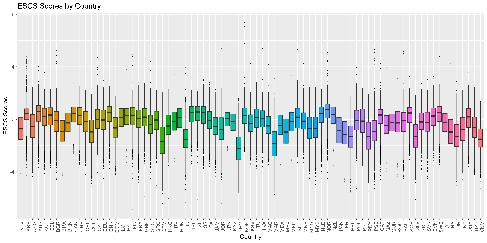
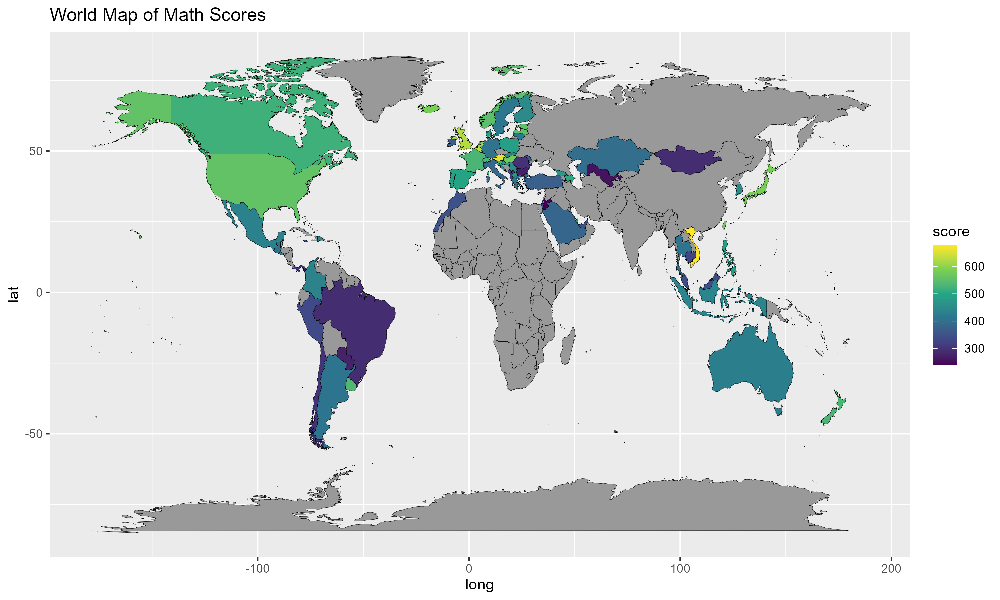
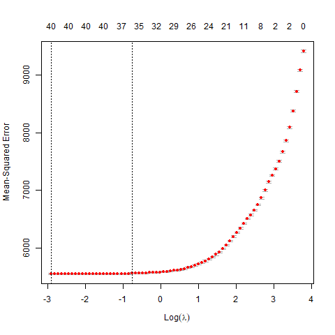
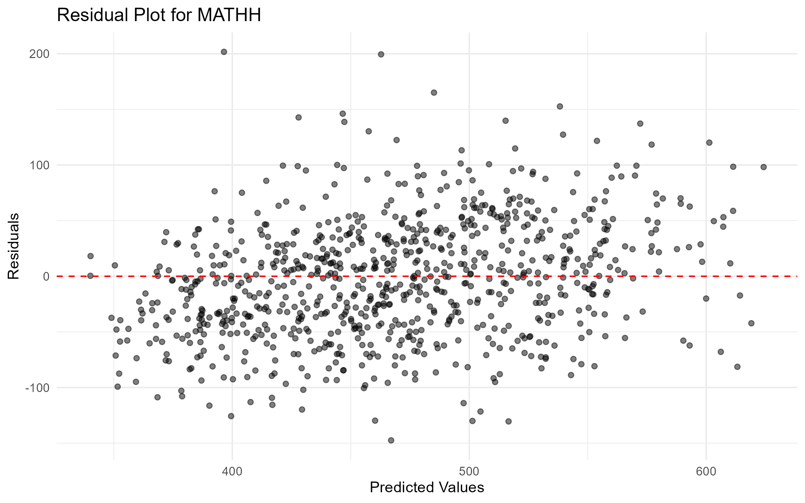

# Socioeconomic Status and Academic Achievement in PISA 2022

An end-to-end R pipeline examining how socioeconomic status (SES) relates to 15-year-olds' math, reading, and science performance across 79 countries in the OECD PISA 2022 dataset (N ≈ 614,000 students).

**Question:** Which home and family background factors best predict achievement, and how well can SES indicators alone predict a student's scores?

## Pipeline

| Step | Script | What it does |
|------|--------|--------------|
| 1 | `R/01_data_prep_eda.R` | Converts the 1.95 GB SPSS file to RDS, filters variables by missingness, imputes ESCS at the country level, computes summary statistics and correlations |
| 2 | `R/02_visualization.R` | ESCS distribution by country; world maps of mean math, reading, and science scores; interactive Plotly versions ([live demo on RPubs](https://rpubs.com/RumeysaGorgulu/pisa2022-visualization)) |
| 3 | `R/03_modeling.R` | LASSO regression (10-fold CV) to select the strongest SES predictors; KNN regression to predict scores for U.S. students; evaluation with RMSE, R², MAE, and residual plots |

## Key findings

- Parental doctoral education was the strongest positive predictor of achievement in all three subjects; digital device ownership showed a consistent negative association.
- SES indicators alone explain roughly 70% of score variance in the U.S. sample.

| Subject | RMSE | R² | MAE |
|---------|------|----|-----|
| Math | 52.6 | 0.689 | 42.2 |
| Reading | 63.5 | 0.676 | 50.2 |
| Science | 58.5 | 0.717 | 47.0 |

## Figures

| ESCS by country | Mean math score by country |
|---|---|
|  |  |

| LASSO cross-validation (math) | KNN residuals (math) |
|---|---|
|  |  |

Reading and science versions of each plot are in `plots/`.

## Reproducing

1. Download the PISA 2022 Student Questionnaire (SPSS) from https://www.oecd.org/pisa/data/ and place `CY08MSP_STU_QQQ.SAV` in `data/`.
2. Install dependencies:
   ```r
   install.packages(c("haven", "tidyverse", "stringr", "ggplot2", "plotly",
                      "countrycode", "htmlwidgets", "glmnet", "tidymodels", "kknn"))
   ```
3. From the repository root, run the scripts in order: `01_data_prep_eda.R` → `02_visualization.R` → `03_modeling.R`.

Intermediate data files are written to `data/` and are git-ignored; figures are written to `plots/`.

## Methods summary

- **Data preparation:** threshold-based removal of high-missingness variables; country-level mean imputation of the ESCS index.
- **Variable selection:** LASSO with λ chosen by 10-fold cross-validated MSE, run separately per subject.
- **Prediction:** KNN regression via `tidymodels`, k tuned by 10-fold CV, evaluated on a held-out test set.

## License

MIT — see `LICENSE`.

## Author

Rumeysa Gorgulu
